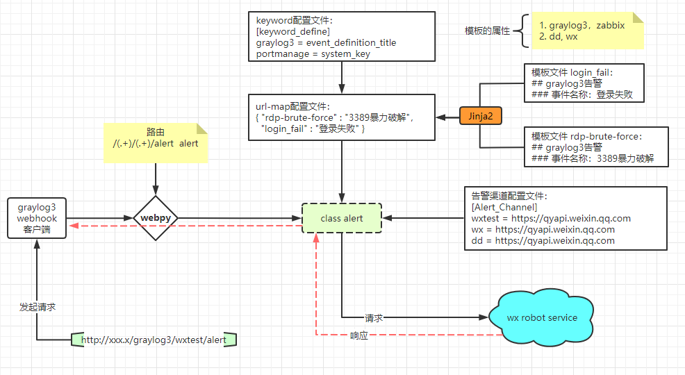
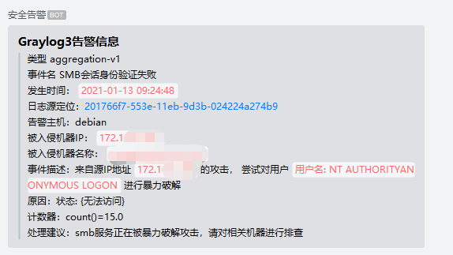

# 告警消息转发平台
#### 1. 特性：
1. 支持graylog3,自研平台
2. 根据对应系统，定义消息内容的key，并且根据key的value选择对应模板
3. 支持钉钉，微信告警渠道配置，可同时支持多个
4. 采用jinja2模板引擎 

#### 2. 平台逻辑架构
  

#### 3. API调用方法：
只支持POST方法  
`http://[IP]:[port]/[系统]/[渠道]/alert`  
[系统]： 系统识别关键字(keyword)  
[渠道]： 告警渠道配置(channel)  

举例：  
```
http://127.0.0.1/graylog3/wxtest/alert  
http://127.0.0.1/portmanage/wx/alert  
http://127.0.0.1/portmanage/dd/alert  
```
  
#### 4. 告警渠道配置  
配置文件路径：`conf/channel`    
支持自定义命名（举例）：  
`[渠道] = 机器人的webhook链接`    
```
wx = https://qyapi.weixin.qq.com/cgi-bin/webhook/send?key=2effe5dc-b9xx-491f-94b0-826xxxx96
```

#### 5. 系统识别关键字  
配置文件路径：`conf/keyword`    
`[系统] = 请求json的key`    
配置举例：  
```
graylog3 = event_definition_title
portmanage = system_key
```

#### 6. 模板映射  
配置文件路径：`conf/urlmap`    
使用json格式的配置文件  
`{"[模板名称]":"[匹配关键字]"}`   
配置举例：  
```
{
    "login_fail_type_3": "登录失败",
    "rdp_brute_force": "3389暴力破解",
    "test": "Event Definition Test Title",
    "ali_riskport": "ali_sec_group",
    "ucloud_riskport": "ucloud_fw_group",
    "fw_riskport": "fw_port_map"
}
```

#### 7.模板文件编写
模板文件路径： `AlertSource/[系统]/[wx or dd]/templates/[模板]`  
模板需用markdown格式编写  
举例（login_fail_type_3）：
```
### [Graylog3告警信息](http://graylog.org)
> 类型 {{ event_definition_type}}
> 事件名 {{ event_definition_title}}
> 发生时间：`{{ backlog[0].fields.EventReceivedTime }}`
> 日志源定位：[{{backlog[0].id}}](http://172.16.1.111:9000/messages/{{backlog[0].index}}/{{backlog[0].id}})
> 告警主机：{{ event.source}}
> 被入侵机器IP：`{{ event.fields.source_host}}`
> 被入侵机器名称：`{{ event.fields.source}}`
> 事件描述：来自源IP地址 `{{ event.fields.IpAddress}}` 的攻击， 尝试对用户  `{{ event.fields.TargetUserName}}` 进行暴力破解
> 计数器：{{ event.message}}
> 处理建议：{{ event_definition_description}}
```
告警截图
 


